<div align="center">


</div>

---

### 🕯️ CHARACTER SHEET

```yaml
name: B100per
class: Game Developer
weapon_arts: Godot, gameplay systems, design-to-code
current_quest: [REDACTED] — a quest bound by ancient pact (NDA)
```

I build games and tools — mostly with Godot. Currently on a long quest rebuilding a game client, rune by rune.

---

### 📜 STATUS

<div align="center">



</div>

---

### 🛡️ EQUIPMENT

<div align="center">



</div>

---

### ⚔️ ARMAMENTS

<div align="center">


</div>

---

### 🏰 GREAT RUNES (Legacy Dungeons Cleared)

- 🎮 **FiveGuardians** — team-based game project
- 🎧 **AudioGame** — audio-driven gameplay experiment
- 🏆 **Showroom-Gamification** — gamified showroom experience
- 💰 **AIFinance** — AI-assisted finance modeling

---

### 💀 RUNES COLLECTED

<div align="center">


</div>

---

<div align="center">

`"Arise now, ye Tarnished. Ye dead, who yet live."`


</div>
